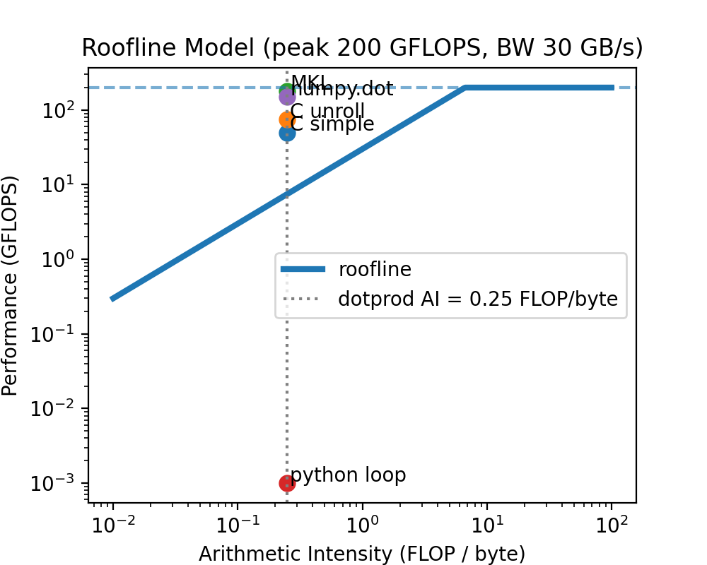

# Fred Angelo Garcia (fbg2107)
```
Note, all the print statements and calculation results of  
- /dp1.c
- /dp2.c
- /dp3.c
- /dp4.py
- /dp5.py
are located in ./STDOUT
```

## Summary of benchmark results

Here are the benchmark performance for the 10 runs: 
Recall, for $N=1000000$, we repeat for 1000, while for $N=300000000$ we repeat $20$ times 
### C1 simple `dp`
```
N: 1000000 <T>: 0.001510 sec  <B>: 4.934005 GB/sec  <F>: 1.324462 GFLOP/sec
N: 300000000 <T>: 0.454184 sec  <B>: 4.921297 GB/sec  <F>: 1.321051 GFLOP/sec
```
### C2 `dpunroll`
```
N: 1000000 <T>: 0.000565 sec  <B>: 13.189902 GB/sec  <F>: 3.540637 GFLOP/sec
N: 300000000 <T>: 0.262146 sec  <B>: 8.526440 GB/sec  <F>: 2.288799 GFLOP/sec
```
### C3 `bdp` from MKL
```
N: 1000000 <T>: 0.000085 sec  <B>: 87.629475 GB/sec  <F>: 23.522858 GFLOP/sec
N: 300000000 <T>: 0.054169 sec  <B>: 41.262987 GB/sec  <F>: 11.076449 GFLOP/sec
```
### C4 simple python loop
```
N: 1000000 <T>: 0.331768 sec B: 0.022457 GB/sec F: 0.006028 GFLOP/sec
N: 300000000 <T>: 93.157021 sec B: 0.023994 GB/sec F: 0.006441 GFLOP/sec
```
### C5 numpy.dot
```
N: 1000000 <T>: 0.000350 sec B: 21.286896 GB/sec F: 5.714158 GFLOP/sec
N: 300000000 <T>: 0.200367 sec B: 11.155392 GB/sec F: 2.994503 GFLOP/sec
```
## Q1

The rational and expected consequence of only using the second half of the repitions for each benchmark is the idea of burn-in, or a warm-up phase in the benchmark before the cores can reach peak performance (due to e.g., [cache cold start](https://en.wikipedia.org/wiki/Cold_start_(computing)), which is sometimes even more important in cloud computing servies). By doing this, we are able to get a better guage of the max computational capabilities of a system for a given algorithm. 

In lecture, we talked about three different kinds of mean: arithmetic, harmonic, and geometric. I think the type of mean most approrpiate for these calculations is the harmonic mean:
$$
\bar{x_H} = \dfrac{n}{\sum^{n}_{i=1} \frac{1}{x_i}}
$$
for $n$ measurements of quantity $x$. 
The main purpose of this benchmark was to see performance of the system for different algorithms doing the same amount of work (same vector size $N$). According to our discussions in class, this types of mean is best for averaging rates like throughput (after burn-in) when the individual measurements are inversely related to the total performance. Geometric mean would only be usefull if we were comparing differnt systems with different specifications.

## Q2
First, we have to look at the arithmetic intensity (AI) of a dot product, which will be what the x-value for our roofline plot: the same computation is done across all benchmarks. So, our AI is: 

$$
AI = \dfrac{\rm arithmetic ~operations ~in ~FLOP}{\rm DRAM~data~in~bytes}
$$
where, for a dot product of single-precission (32 bit, 4 bytes) floats with vector size $N$, we add and multiple (2 operations): $2N$, with bytes from DRAM $2N \times 4$. Giving us:
$$
AI = \dfrac{2N}{8N} = 0.25 ~{\rm FLOP/byte}
$$
across all algorithms. For example, the unroll only changes how the CPU sequentializes operations it does not change the number of FLOPs or the number of bytes that must be read from DRAM therfore the [AI is equivalent for all dot products](https://lemire.me/blog/2019/04/12/why-are-unrolled-loops-faster/#:~:text=Mathematically%2C%20both%20pieces%20of%20code%20are%20equivalent.).

Now, for our roofline model, we were given a peak CPU performance of 200 GFLOP/sec and DRAM bandwith of 30 GB/s. In the plot below, we show the results of the 10 runs, stating the harmonic mean (after burn in) for algorithm (dp1 - dp5) and, for each, using $N = 10^6$ (shown as circles) and $N = 3\times 10^8$ (shown as X): 



Based on the plot above, all appear to be memory bound: they are to the left of the "knee" (intersection between the peak performance and memory bandwidth) in the roofline plot.  This makes sense since the AI is fairly low for a simple dot product, so the spread is namely in the performance (y-axis) which is determined by how well the algorithm uses the memory bandwidth. 

Starting with the C variants. We see that the dp1 has the lowest performance, which is expected since it is a simple implementation without any optimizations. The dp2 (unroll, orange) has some improvement (around 4 times) when compare to dp1 (with $N = 10^6$) since it can run several iterations' worth of work in each pass. Sticking with the $N = 10^6$ (circles) using the MKL (dp3, green), we see that we are able to get a performance boost of around 20 times over dp1. In fact, an interesting thing is that is surpasses the memory bandwidth limit (30 GB/s) which is likely due to some caching effects (the vectors are small enough to fit in L1/L2/L3 cache), so we are not actually reading from DRAM exclusively for every operation and therefore not limited by the memory bandwidth. This might be some optimizations automatically done by the MKL library.

Now on to the python variants. The simple python loop (dp4, red) is the slowest of all the algorithms at around 0.006 GFLOP/sec (for $N = 10^6$) which is expected since python is an interpreted language. The numpy.dot (dp5, purple) starts to rival the performance of the dp2 (unroll) at around 4 GFLOP/sec (for $N = 10^6$). 

In short, the C simple implementation is memory bound (not fully vectorized), the unroll helps a bit (limited by DRAM throughput still), the MKL is very optimized and can even surpass memory bandwidth limits due to caching effects. The python simple loop is very slow due to the interpreted nature of python (algprithm bottlenecks such as), but numpy.dot is able to be competitive with the C unroll implementation. 

## Q3

Using $N= 3\times 10^8$ as simple loop as the baseline (1.321051 GFLOP/sec, blue X) we see that going from $N = 10^6$ to $N=3\times 10^8$ we don't see much change in performance. However, in the $N=3\times 10^8$ case, going from a simple loop to an unroll more than doubles the performance (2.288799 GFLOP/sec, orange X). The MKL (green X) is still the best at around 10 GFLOP/sec, while the larger array is still above the DRAM 30 GB/s it is less so than the smaller vector, likely because it can no longer fit as much in the cache.

The simple python loop (red X) is still the slowest at around 0.006 GFLOP/sec, while numpy.dot (purple X) is around 3 GFLOP/sec. Algorithmicly speaking, the gains in using differnt algorithms when using C is less pronounced because the memory bandwidth is the bottleneck. However, in python, the gains are more pronounced because the algorithmic improvements from numpy (which is techincally C BLAS code wrapped in python) help to overcome some of the language bottlenecks that comes with a simple loop: e.g., dynamic typing (which can be overcome with jit, but is not part of this excercise). 

## Q4
Here are some results for the $N=3\times 10^8$ case (note the full output of each run can  be found in STDOUT):
dp1
```
run 19: 0.449682 sec, result=16777216.000000
```

dp2
```
run 19: 0.254202 sec, result=67108864.000000
```

dp3
```
run 19: 0.053505 sec, result=300000000.000000
```

dp4
```
run 19: 93.105223 sec result=16777216.0
```

dp5
```
run 19: 0.202415 sec result=300000000.0
```

Note, the analytic result when vectors are all 1.0 is exactly N, so 300000000.0. For dp1, this is the result of overflow since we are using a float (32 bit) to accumulate the sum. The maximum representable integer in a EEE-754 single precision (float32) is 16777216, so we see that the result is exactly this value. For dp2, we are adding 4 values at a time, so the maximum representable integer is 4 times this value or 67108864, which is what we see. Note this is a different from the maximum value, this is just the maximum __exact__ value. The 32 bit float has a 24-bit significant digit places, which consists of a 1-bit implicit leading '1' and a 23-bit stored fraction. In short, this provided 7 decimal digits of precision ([wikipedia](https://en.wikipedia.org/wiki/Single-precision_floating-point_format)) $2^{24} = 16777216$, so we can represent all integers up to this value exactly. Afterwards, the change or spacing in floating point addition becomes greater than 1-- so that adding 1 does noting! For the unrolled, there are 4 accumulators at a time, so the maximum exact value is 4 times this. For the dp3 and dp5, we declare the accumulator as single precision floats, these packages tend to use higher precision accumulators insidr their functions (e.g., promotes my single precision to double precision) to avoid this overflow issue and is then cast back to single precision at the end. So these results are don't encounter this overflow issue and return the correct result of 300000000.0.