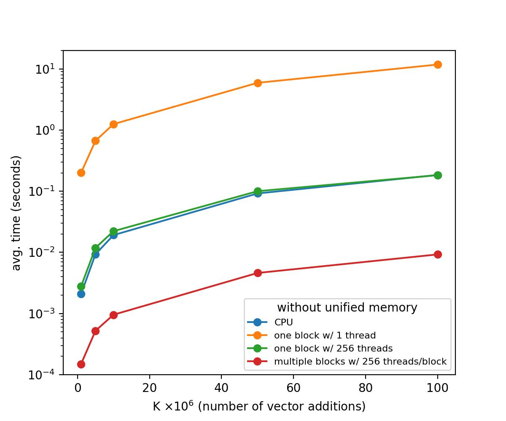
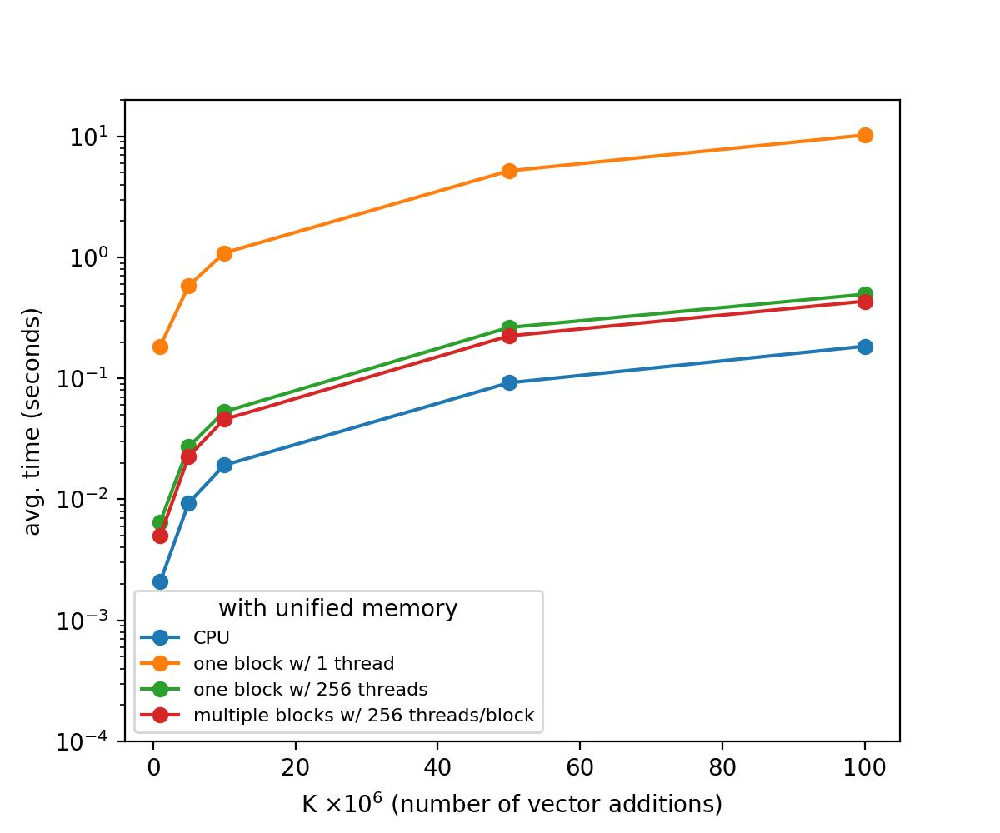

# fbg2107 - HW3


## Part A 

the code for Part A is in the `pset3/PartA/` directory.
The Makefile therein is just for this part.
in additon to the kernel codes required we also have
```
vecaddKernel01.cu
matmultKernel01.cu
```

for each problem, there are also batch scripts to run multiple trials and python scripts to analyze the results by taking averages.

The files to do multiple run for each configuration (either values per threa   d or matrix size) and save the results to text files are in
```
run_trial_save_analyze_Problem1.sh
run_trial_save_analyze_Problem2.sh
```
the raw data can then be found in `results`, which is then prcess by 
```
analyze_trials_P1_q1q2.py
analyze_trials_P1_q3q4.py
```
the output of which are piped to text files in `results` as well.

We will discuss them, in turn, below.


### Problem  1 - Vector add and coalescing memory access


#### Q1: The response is in the Makefile, but here we highlight the relevant lines

```Makefile
# original non-coalesced vector addition (Q1)
vecaddKernel00.o : vecaddKernel00.cu
	${NVCC} $< -c -o $@ $(OPTIONS)

# dependencies for timing, note we are using vecadd.cu as main program
# but vecaddKernel00.o as the kernel object file, this can change as 
# as we see below, where we write a different kernel 
vecadd00 : vecadd.cu vecaddKernel.h vecaddKernel00.o timer.o 
	${NVCC} $< vecaddKernel00.o -o $@ $(LIB) timer.o $(OPTIONS)
```

> and also we chose to run each configuration for 5 trials, as shown below in `run_trial_save_analyze_Problem1.sh` to have robust measurements by averaging the time it takes for each trial.


#### Q2: The output of this experiment is  STDOUT_analysis_q1q2

```
Q1 - vecadd00 (Non-coalesced Memory Access)
--------------------------------------------------
500 values/thread:
  Trials: 5
  Avg Time: 0.000815 sec
  Min Time: 0.000796 sec
  Max Time: 0.000829 sec
  Std Dev:  0.000013 sec
  Avg GFlops/S: 4.712858
  Avg GBytes/S: 56.554295
1000 values/thread:
  Trials: 5
  Avg Time: 0.004187 sec
  Min Time: 0.001795 sec
  Max Time: 0.012657 sec
  Std Dev:  0.004742 sec
  Avg GFlops/S: 3.141563
  Avg GBytes/S: 37.698762
2000 values/thread:
  Trials: 5
  Avg Time: 0.004246 sec
  Min Time: 0.003024 sec
  Max Time: 0.008118 sec
  Std Dev:  0.002170 sec
  Avg GFlops/S: 4.135380
  Avg GBytes/S: 49.624565

Q2 - vecadd01 (Coalesced Memory Access)
--------------------------------------------------
500 values/thread:
  Trials: 5
  Avg Time: 0.000356 sec
  Min Time: 0.000312 sec
  Max Time: 0.000410 sec
  Std Dev:  0.000036 sec
  Avg GFlops/S: 10.881106
  Avg GBytes/S: 130.573276
1000 values/thread:
  Trials: 5
  Avg Time: 0.000699 sec
  Min Time: 0.000651 sec
  Max Time: 0.000748 sec
  Std Dev:  0.000044 sec
  Avg GFlops/S: 11.022135
  Avg GBytes/S: 132.265613
2000 values/thread:
  Trials: 5
  Avg Time: 0.001448 sec
  Min Time: 0.001283 sec
  Max Time: 0.001505 sec
  Std Dev:  0.000094 sec
  Avg GFlops/S: 10.645869
  Avg GBytes/S: 127.750435

PERFORMANCE COMPARISON - Coalesced vs Non-coalesced
------------------------------------------------------------
Speedup = Non-coalesced Time / Coalesced Time
(Higher speedup = better performance)
------------------------------------------------------------
 500 values/thread: 2.29x speedup (++129.2%)
1000 values/thread: 5.99x speedup (++499.1%)
2000 values/thread: 2.93x speedup (++193.2%)
```

> Based on our observations, changing from non-coalesced to coalesced memory access broadly increases the performance of the vector addition operation. This is as expected because coalesced memory access allows for more efficient use of the GPU's memory bandwidth by accessing things that are close together in memory, reducing the number of memory transactions required.


### Problem 2 - Matrix multiplication with shared memory and loop unrolling
The BLOCK_SIZE is the number of threads in a thread block (16x16 = 256 threads). This is always 16 for both matmult00 and matmult01.

The FOOTPRINT_SIZE (changing from 16 to 32), changes the size of the output submatrix that each thread block computes.

So for matmult00 
- Threads per block: 16 × 16 = 256 threads
- Elements per block: 16 × 16 = 256 elements  
- Elements per thread: 256 / 256 = 1 element
and for matmult01
- Threads per block: 16 × 16 = 256 threads
- Elements per block: 32 × 32 = 1024 elements  
- Elements per thread: 1024 / 256 = 4 elements


#### Q3: here, we chose to 8 trials for each matrix size to have robust measurements by averaging the time it takes for each trial, as shown in `run_trial_save_analyze_Problem2.sh`.

and the output of this experiment is  STDOUT_analysis_q3q4

```
matmul averaging
================================================================================
Matrix       Version    Trials Avg Time (s) Avg GFlops/S Min Time   Max Time  
--------------------------------------------------------------------------------
256x256      matmult00  8      0.000096    367.05    0.000069  0.000114
512x512      matmult00  8      0.000621    454.12    0.000425  0.000752
1024x1024    matmult00  8      0.003590    605.20    0.002881  0.004056
256x256      matmult01  8      0.000054    648.98    0.000040  0.000075
512x512      matmult01  8      0.000323    884.55    0.000218  0.000422
1024x1024    matmult01  8      0.002443    956.86    0.001545  0.003400
--------------------------------------------------------------------------------

speedup (matmult01 vs matmult00)
==================================================
Matrix Size  Speedup    GFlops Improvement  
--------------------------------------------------
256x256      1.76x     +76.8%
512x512      1.92x     +94.8%
1024x1024    1.47x     +58.1%

================================================================================
SUMMARY STATISTICS
================================================================================

matmult00:
  256x256: 8 trials, std dev: 0.000020s
  512x512: 8 trials, std dev: 0.000142s
  1024x1024: 8 trials, std dev: 0.000398s

matmult01:
  256x256: 8 trials, std dev: 0.000014s
  512x512: 8 trials, std dev: 0.000086s
  1024x1024: 8 trials, std dev: 0.000731s

```

#### Q4: Results of the experimemt

show that matmult01, which uses shared memory and loop unrolling, consistently outperforms matmult00 across all tested matrix sizes. 

The speedup ranges from approximately 1.47x to 1.92x, with the most significant improvement observed at the 512x512 matrix size. This shows that there is an optimum matrix size (in this case 512x512) where the benefits of shared memory and loop unrolling are most pronounced. When it gets too large (1024x1024), the speedup decreases, possibly due to increased memory access overhead or other factors.

Nonetheless, the use of shared memory and loop unrolling in matmult01 leads to substantial performance improvements in matrix multiplication on the GPU, almost reaching double in some cases.


#### Q5: some performance suggestion
- memomry coalescing    ensures adjacent threads are accesed
- unrolling loops reduces the overhead of loop control and increases instruction-level parallelism
- computing more per thread by increasing footprint size reduces the number of thread blocks and overhead associated with managing them
- there might be diminishing returns when increasing footprint size too much due to increased register pressure and memory access overhead

## Part-B: CUDA Unified Memory 

Compare vector operations executed on host vs on GPU to quantify the speed-up.

This section is done with the same approach and structure, note we used the same timer function from Part A, we just renamed it to `timer.cpp` for compilation.
```
-rw-r--r-- 1 fbg2107 fbg2107   706 Nov 21 18:44 Makefile
-rwxr-xr-x 1 fbg2107 fbg2107 17664 Nov 21 04:36 q1
-rw-r--r-- 1 fbg2107 fbg2107  2780 Nov 21 20:40 q1.cpp
-rw-r--r-- 1 fbg2107 fbg2107   329 Nov 20 22:17 q1_averages_summary.txt
-rwxr-xr-x 1 fbg2107 fbg2107  1004 Nov 21 04:19 q1_trials_script.sh
-rwxr-xr-x 1 fbg2107 fbg2107 27536 Nov 21 23:47 q2
-rw-r--r-- 1 fbg2107 fbg2107  7947 Nov 21 23:51 q2.cu
-rwxr-xr-x 1 fbg2107 fbg2107  1306 Nov 21 16:24 q2_trials_script.sh
-rwxr-xr-x 1 fbg2107 fbg2107 27392 Nov 21 18:43 q3
-rw-r--r-- 1 fbg2107 fbg2107  6202 Nov 21 23:47 q3.cu
-rwxr-xr-x 1 fbg2107 fbg2107  1377 Nov 21 18:43 q3_trials_script.sh
-rw-r--r-- 1 fbg2107 fbg2107 11247 Nov 21 20:40 q4.py
-rw-r--r-- 1 fbg2107 fbg2107 79291 Nov 21 23:53 q4_with_unified.jpg
-rw-r--r-- 1 fbg2107 fbg2107 78989 Nov 21 23:53 q4_without_unified.jpg
drwxr-xr-x 2 fbg2107 fbg2107  4096 Nov 21 23:53 results
-rw-r--r-- 1 fbg2107 fbg2107  1253 Nov 21 03:48 timer.cpp
-rw-r--r-- 1 fbg2107 fbg2107   522 Nov 21 03:48 timer.h
-rw-r--r-- 1 fbg2107 fbg2107  6712 Nov 21 04:34 timer.o
```

In addition to what was asked we also wrote scripts to automate 
`q1_trials_script.sh`, `q2_trials_script.sh`, `q3_trials_script.sh` to run multiple trials for different values of K (size of vectors in millions) and save the results to text files in `results/` directory.

Finally, this data is post processed and whatnot for averages as well as plotted for Q4  and is done in `q4.py`.

### Q1 
Here are the average results for Q1:
```
K avg_time(s) avg_BW(GB/s) avg_GFLOP/s
1 0.002086210251 5.465577734215 0.489051617129
5 0.009333992004 5.993899830868 0.536325078106
10 0.019168758392 5.830758696457 0.521727456503
50 0.092004871368 6.074042939642 0.543496162089
100 0.184517955780 6.058384558238 0.542095073838
```

### Q2 nonUnified Memory version
Here are the average results for Q2 (non-unified memory version):
```
K Scenario avg_time(s) avg_BW(GB/s) avg_GFLOP/s
1 1 0.200423622131 0.111603769348 0.004993068119
1 2 0.002782583237 8.032750351288 0.359379167247
1 3 0.000149345398 149.739823709605 6.699246309808
5 1 0.668115949630 0.167277399873 0.007483864186
5 2 0.011853647232 9.486738745779 0.424429506862
5 3 0.000522565842 213.870468397809 9.568402784883
10 1 1.252671957016 0.178435731384 0.007983079487
10 2 0.022222614288 10.058939931502 0.450029354565
10 3 0.000956630707 233.658750734591 10.453715550305
50 1 5.929305791855 0.188486438225 0.008432740499
50 2 0.100202846527 11.154430355526 0.499040766484
50 3 0.004606866837 242.591866092587 10.853376366076
100 1 11.781501483917 0.189718988485 0.008487883864
100 2 0.183037233353 12.219445168486 0.546688722645
100 3 0.009260988235 241.353830442952 10.797987588717
```

### Q3 Unified Memory version
also stored in the directory `results/` are the average results for Q3 (unified memory version):
```
K Scenario avg_time(s) avg_BW(GB/s) avg_GFLOP/s
1 1 0.184779071808 0.121063959839 0.005416309877
1 2 0.006499767303 3.446873835570 0.154210524971
1 3 0.004982995987 4.488481686457 0.200811271375
5 1 0.583937597275 0.191397754793 0.008562990598
5 2 0.027215051651 4.111342559982 0.183938352477
5 3 0.022680616379 4.928769488042 0.220509414174
10 1 1.089886617660 0.205089977209 0.009175570259
10 2 0.053059864044 4.215309893795 0.188589772254
10 3 0.045818138123 4.881081848937 0.218375905316
50 1 5.189038324356 0.215375546648 0.009635738846
50 2 0.263823032379 4.241069884242 0.189742254717
50 3 0.224498176575 4.981047836012 0.222848307869
100 1 10.256094980240 0.217939277206 0.009750438209
100 2 0.495988655090 4.510801891350 0.201809860439
100 3 0.434904384613 5.139927252743 0.229956452649
```

### Q4 Analysis 

Note, the trials here are the arithmetic averages of the time taken in 5 trials for each configuration.

>The figure is here for non-unified memory version for the three scenarios for the GPU implementaiton: using one block with one thread (orange), using one block with 256 threads (green), and using multiple blocks with 256 threads each (red).
>
> We see that for both the sole CPU and CPU + GPU, as K increases, the  time taken for addition increases, which makes sense. The slowest is the one block with one thread (orange), which is expected since it cannot really use the parallelism of the GPU.  The one block with 256 threads (green) is better, decreasing by around 2 order of magnitude. This is comparable to the CPU only implementation in blue, which might hint at the overhead of data transfer between host and device when we use one block with 256 threads. The best performance is achieved when we use multiple blocks with 256 threads each (red). This uses the full parallelism of the GPU and is by far the faster with an order of magnitude improvement over the one block with 256 threads (green) and CPU.


>While here are the figures for unified memory version:

>This one is a little tricky. The scaling as function of K is still the same. And the trend amongst the GPU setups are still consistent with the non-unified memory version: one block with one thread (orange) is the slowest, one block with 256 threads (green) is better, and multiple blocks with 256 threads each (red) is the best. However, CPU appears teh fastest here, which is counter-intuitive. 

> However, we are told in the Lecture 6 that harware automatically manages data movement between different memory leveles in unified memory and that UVM is primarily about ease of programming. That is, it is not primarily a "technique to make well written CUDA codes run faster" nad that "it can't do better than epxertly written manual data movement; in most cases it can be harder to achiev expected concurrnecy behavior". In a simple case such as vector addition, it is possible that the overhead of UVM management outweighs the benefits of GPU parallelism.


## Part-C: Convolution in CUDA

The code for Part C is in the `PartC/` directory.

```
 4 -rw-r--r-- 1 fbg2107 fbg2107  2901 Nov 22 02:01 hw3_c4.ipynb
 4 -rw-r--r-- 1 fbg2107 fbg2107   522 Nov 22 02:50 timer.h
 4 -rw-r--r-- 1 fbg2107 fbg2107  1253 Nov 22 02:50 timer.cu
 8 -rw-r--r-- 1 fbg2107 fbg2107  6339 Nov 22 05:02 c1.cu
 8 -rw-r--r-- 1 fbg2107 fbg2107  7568 Nov 22 05:25 c2.cu
12 -rw-r--r-- 1 fbg2107 fbg2107  8772 Nov 22 05:25 c3.cu
 4 -rw-r--r-- 1 fbg2107 fbg2107   597 Nov 22 05:26 Makefile
28 -rwxr-xr-x 1 fbg2107 fbg2107 27472 Nov 22 05:26 c1
32 -rwxr-xr-x 1 fbg2107 fbg2107 31584 Nov 22 05:26 c2
24 -rwxr-xr-x 1 fbg2107 fbg2107 23992 Nov 22 05:26 c3
 4 -rwxr-xr-x 1 fbg2107 fbg2107    54 Nov 22 05:29 partc.sh
 4 -rw-r--r-- 1 fbg2107 fbg2107  1126 Nov 22 05:29 STDOUT
```
the output of all three scripts is piped into `STDOUT` for easy reference.

run ` partc.sh` to run all three parts in sequence.

### C1: Simple convolution 
This is the barebones implementation-- we don't tile anything. The outline of the code (also in `c1.cu`)
```
brief outline of the
we are told that we are implemneting a 2D convolution with multiple input channels
breif recall

input tensor I with dimension:
- C = 3
- H = 1024
- W = 1024
so the total element is: 3 x 1024 x 1024 = 3145728

a set of filters:
F[K, C, FH, FW]
- K = 64    filters
- C = 3     channels
- FH = 3    filter height
- FW = 3    filter widht
total elements: 64 × 3 × 3 × 3 = 1728

the outputL
O[K, H, W]
K = 64      output channels
H = 1024    height
W = 1024    widht

the pseudocode is something  like
O[k,x,y] = sum over c=0..C-1
           sum over j=0..FH-1
           sum over i=0..FW-1
           F[k,c,FW-1-i,FH-1-j] * I0[c,x+i,y+j]

where I0 is the padded input tensor, extending it to
I0[C, H+2*P, W+2*P]
P = 1 is the padding size
so that the output tensor has the same height and width as the input tensor
```

the output of running `./c1` is in `STDOUT`, and the relevant section is
```
convolution Configuration:
  I:  [C=3, H=1024, W=1024] -> Padded: [3, 1026, 1026]
  F: [K=64, C=3, FH=3, FW=3]
  O: [K=64, H=1024, W=1024]
initializing padded input tensor...
initializing filters...
copying data to device...
kernel configuration: grid(64, 64, 64), block(16, 16, 1)
running convolution kernel...
122756344698240.000000, 26.471 [ms]
```


### C2: tiled convulution 
This is the tiled implementation-- tiling to optimize performance
```
tiled Convolution :
  I:  [C=3, H=1024, W=1024] -> Padded: [3, 1026, 1026]
  F: [K=64, C=3, FH=3, FW=3]
  O: [K=64, H=1024, W=1024]
  chosen tile size: 16x16
Initializing padded input tensor...
Initializing filters...
Copying data to device...
Kernel configuration: grid(64, 64, 64), block(16, 16, 1)
Shared memory per block: 7.59 KB
Running tiled convolution kernel...
122756344698240.000000, 26.789 [ms]
```

### C3: cuDNN convolution
The output of this implementation is in `STDOUT`, and the relevant section is
```
cuDNN Convolution:
  I:  [N=1, C=3, H=1024, W=1024]
  F: [K=64, C=3, FH=3, FW=3]
  O: [N=1, K=64, H=1024, W=1024]
  padding: 1
initializing input tensor...
Initializing filters...
Copying data to device...
finding fastest convolution algorithm...
selected algorithm: 2
expected time from warmup: 38.740 ms
running cuDNN convolution...
FINAL: 122756344698240.000000, 38.457 [ms]
```
This part was done with the help of the cuDNN documentation and examples from ed. 

So in short, the program outputs are: 
```
122756344698240.000000, 26.471 [ms]
122756344698240.000000, 26.789 [ms]
122756344698240.000000, 38.457 [ms]
```

> Some commenatry on the performance of the three implementations. The tiling vs naive is suprising in that we expect tiling to be faster. This speed up might not materialize, for example. since we have a small 3x3 filter size and also the caches might effectively handle the memory access pattern well enough in this case of small convolutions and the shared memory overhead might not be worth it for indexing and __syncthreads. Now for using cuDNN. One is because cuDNN uses double precision by default, which slows things down. Also, the algorithmn selection might not be optimal for this specific case. CuDNN is designed to be a general-purpose library and, like in the last question, in the unified memory case, the overhead of generality due to ease of use might outweigh the benefits in this specific case.