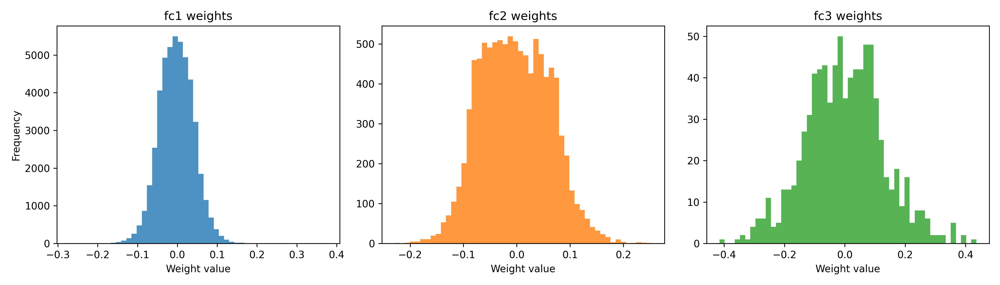
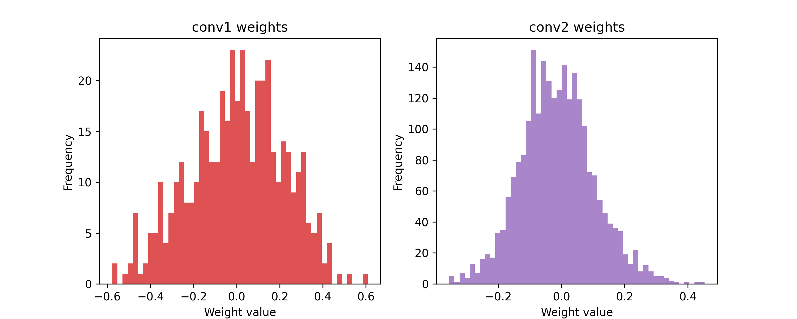
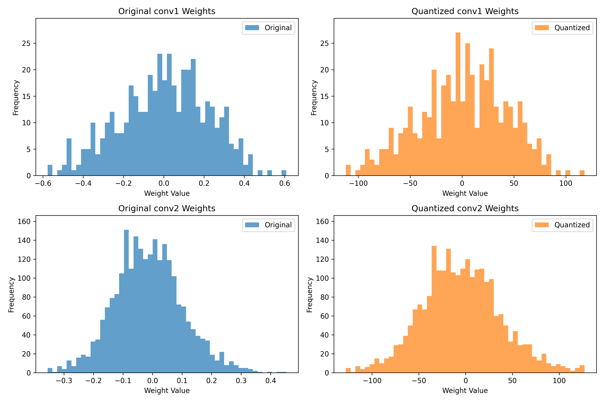
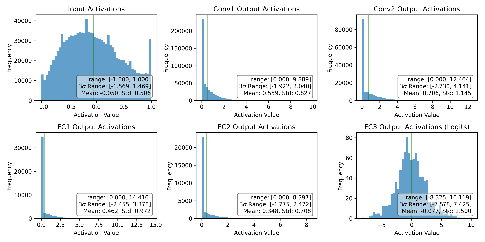

# pset 4 - Fred Angelo Garcia (fbg2107)

## Q1: Visualize Weights 

Note, the architecture is basically
- 2D convolutional layer
- 2D max pooling layer
- 2D convolutional layer
- and 3 fully connected layers, which 
means
the data flows like this:
```
input (3×32×32) 
    ↓
conv1 (6×28×28)      # 3→6 channels, 32→28 spatial
    ↓ ReLU
pool1 (6×14×14)      # 28→14 spatial
    ↓
conv2 (16×10×10)     # 6→16 channels, 14→10 spatial  
    ↓ ReLU
pool2 (16×5×5)       # 10→5 spatial
    ↓ Flatten
fc1 (400→120)        # 16×5×5 = 400 features
    ↓ ReLU
fc2 (120→84)
    ↓ ReLU  
fc3 (84→10)          # 10 class scores
```

we then show the weights of the first conv layer (conv1) as histograms: 




as well as the convolutional layers: 




## Q2: Quantize Weights

To quantize the weights, we do the following, we also clamp: 
```python
# let's make it dependent on the  value of the wieghts, which we see above
sigma = 3  # we take the hint above
std = torch.std(weights)

scale = 127.0 / (sigma * std)
# actual quantized scale, round to nearest integer, clamp to 8-bit signed range
quantized = torch.clamp((weights * scale).round(), min=-128, max=127)

return quantized, scale
```
Originally, we had that
> Accuracy of the network on the test images: 53.25%
After quantizing the weights, we have that
> accuracy of the network after quantizing all weights: 53.1%
so we see that the accuracy is mostly preserved, and quantization did not affect it too much.

Visually, it would be useful to see the histograms of the quantized weights, which we show below:


We see that that the main features are mostly preserved, we are just using integers in the orange distribution instead of floats in the blue distribution.

## Q3: Visualize Activations 
WE show this in 

along with the 3sigma ranges in each panel.
Note that the input activations range from -1 to 1, while the Conv1, Conv2, and Fc1 and Fc2 are positve, since they are after ReLU layers. While the Fc3 layer has both positive and negative values, since it is the output layer.

## Q4: Quantize Activations

To quantize the activations, we do the following, we  quantized the initial input
```python
max_abs = np.max(np.abs(pixels))

if max_abs == 0:
    return 1.0

# scale so that max_abs maps to 127 (not 128) to avoid potential overflow
scale = 127.0 / max_abs
```
and for the activations 
```python
activations_np = np.array(activations)

cumulative_scale = n_initial_input

for prev_weight_scale, prev_output_scale in ns:
    cumulative_scale *= prev_weight_scale * prev_output_scale

max_abs = np.max(
    np.abs(activations_np)
)  # find the maximum absolute activation value

if max_abs == 0:
    return 1.0  # all activations are zero

# quantized_output ~ floating_activation x (cumulative_scale x n_w x n_output)
# we want |quantized_output| =< 127
# therefore: n_output = 127 / (max_abs x cumulative_scale x n_w)
scale_product = cumulative_scale * n_w

if scale_product == 0:
    return 1.0

n_output = 127.0 / (max_abs * scale_product)

return n_output

```

such that for the forward pass, we have
```python
# scale and quantize the input
x = (x * self.input_scale).round()  # as instructed to use round by the hint above
x = torch.clamp(x, min=-128, max=127)

# process through conv1
x = self.conv1(x)  # integer weights × integer input
x = F.relu(x)  # ReLU (sets negatives to 0)
x = (x * self.conv1.output_scale).round()  # scale output
x = torch.clamp(x, min=-128, max=127)  # clamp to 8-bit range
x = self.pool(x)  # max pooling (works on integers)

# process through conv2
x = self.conv2(x)
x = F.relu(x)
x = (x * self.conv2.output_scale).round()
x = torch.clamp(x, min=-128, max=127)
x = self.pool(x)

# flatten for fully connected layers
x = x.view(-1, 16 * 5 * 5)

# process through fc1
x = self.fc1(x)
x = F.relu(x)
x = (x * self.fc1.output_scale).round()
x = torch.clamp(x, min=-128, max=127)

# process through fc2
x = self.fc2(x)
x = F.relu(x)
x = (x * self.fc2.output_scale).round()
x = torch.clamp(x, min=-128, max=127)

# process through fc3 (no ReLU for final layer)
x = self.fc3(x)
x = (x * self.fc3.output_scale).round()
x = torch.clamp(x, min=-128, max=127)
```


## Q5: Quantize Biases 
Now, for the biases, we initially got:
> Accuracy of the network (with a bias) on the test images: 52.26%


After quantizing the biases, which we simply do:
```python
cumulative_scale = n_initial_input

for prev_weight_scale, prev_output_scale in ns:
    cumulative_scale *= prev_weight_scale * prev_output_scale

total_scale = cumulative_scale * n_w

# quantize the bias
bias_quantized = (bias * total_scale).round()

# clamp to 32-bit signed integer range
bias_quantized = torch.clamp(bias_quantized, min=-2147483648, max=2147483647)

return bias_quantized
```
we got 
>Accuracy of the network on the test images after all the weights and the bias are quantized: 51.1%

so we see that the accuracy is mostly preserved, and quantization did not affect it too much.

## Q6: Grouped Pruning and Quantization (GPTQ)

1. What are the main innovations of GPTQ that enable efficient quantization of models with hundreds of billions of parameters?

> There are several main innovations. A few that stood out to me was the second-rder "Hessian-aware" quantization, which approximate the local loss curvature by using a bloackwise approximation of the Hessian: 
$$
\min_{\hat{w}}(w - \hat{w})^T H (w - \hat{w})
$$
> making the rounding aware of which weigths are the most important to preserve. while the traditional post training quantization rounds these weights independently-- ignoring the error propagation. 

>Another was the lazy update strategy, in that usually when a weight is quantized, every other weight's effective gradient changes. But instead of recomputing Hessian updates explicitly, GPTQ precomputes the update factors and applies them only when necessary, hence the lazy update. This avoids redundancies. 

>Another is more aggresive rounding with second-order corrections in that instead of rounding all weights at once, GPTQ quantizes one weight at a time and this prvents also error accumulation. Also, there is no fine-tuning: one forward pass for activation capture and no retraining is needed as well as need for gradients.

2. What makes GPTQ’s approach more scalable than prior methods, and how does
its use of approximate second-order information address challenges in layer-wise
quantization?

> We touched upon some of these in the previous question, but Figure 2 captures this well, showing the quantization procedure. In this blockwise quantization, GPTQ partitions each weight matrix into small bloacks, computes the Hessian approximation only for tha block, quantize the block, and move on to the next block. THis is in contrast to previous second-rder methods, which assumes you can sotre and invert the Hessian of an __entire__ layer (which is infeasible for large models).

> The problem with layer-wise quantization is that it ignores the inter-layer dependencies and error propagation. Furthermore, some weights are more important than others, and layer-wise quantization does not take this into account. The second order information, which is an approximation of the layer's loss, captures the interactions between the weights, identifies weights the matter most, and it corrects errors after quantizing each weight ad does so sequentially. 

> We see this in Figure 2, where the blocks of consecutive coluns are quantized at a given step using the inverse Hessian information stored in the Cholesky decomposition.

3. Identify one limitation of GPTQ discussed in the paper. Suggest a possible way to address this in future work.

> As a direct qoute to the paper, some shortcomings include: 
> "our method obtains speedups from reduced memory movement, and does not lead to computational reductions. In addition, our study focuses on generative tasks, and does not consider activation quantization."


> The authors already suggested carefully engineering kernels to speed up inference with quantized models, which is a good direction. Taking the authors other point, they could also incorporate activation quantization error into the second order objective. Another would be to extend GPTQ’s second-order, blockwise framework to jointly optimize activation quantization, incorporating activation noise into the objective. So they inlucede the weighst of a submatrix and the activation statistic form the the same block-- this is just one suggestion.